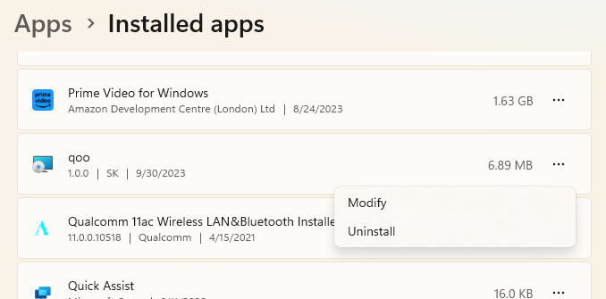

# Qoo Demo

This is a demo of the game I wanted to play for a long time since 90s.
Please take a try and let me know your impressions and/or some thoughts you may have.

I tried to find this sort of game in Apple Store and Microsoft Store but failed to find anything close.
However I should say that I did not search too hard and if you already playing the game like this,
then sorry simply uninstall the game and forget about it.

Also I have to apologize for graphics you will see if you run the game. I'm a developer but my artistic skills
are close to nothing.

## Introduction

I called the game "qoo". The idea of the game is simple.

> 1. The mouse moves with the speed fixed for each level.
> 2. You have to build up the path for the mouse thru the broken maze.
> 3. The level is finished as soon as the mouse got all the food (or baits, if you will) eaten.

The speed is getting increased for each next level.

The score is getting increased only when food (bait) consumed by the mouse. Other game statistics (like time that it takes
to get the level complete or number of your moves) are not taken into account (yet). I may make some modifications
in that respect in the future.

## Install

The game is implemented using OpenGL 3.3. This means that your video driver should support OpenGL 3.3.
I hope that it covers the most of the desktop and laptops computers in use today.

Download all files you can find at https://github.com/sergeyVkryuchkov/demo/qoo somewhere on you computer.
Then run **setup.exe** or **qoo-setup.msi**.

After that you simply run just installed application using the *Qoo-Demo* icon on you desktop.

If the application does not start

> Start command prompt or powershell
> Type manually **.\qoo.exe**

You will see some log output in the console window that should describe what went wrong.

>> Note: In case the app does not start, please copy the output of the cosole window and send it to me.
(See **Reporting problems** section below.)

## Uninstall

To uninstall the application, go the list of installed applications
(this is part of the standard Microsoft Window Settings). Find the **qoo** application and uninstall it:

## Playing

At as soon as the level is loaded and fully displayed it's frozen until you start the game.
You start the game by pressing the **SPACE key** or **any of directional keys**.

The directional keys are **ARROW keys (LEFT, RIGHT, UP, DOWN)** on your keyboard or **4 (for LEFT), 6(for RIGHT),
8 (for UP) and 5 (for DOWN)** on your key-pad part of your keyboard. Please use any of them (or both) whichever fits
the best you habits.

Using these directional keys you control the special green colored cell of the level's maze: that looks like this:

As soon as the you start the playing thru the level you can use **SPACE** key to pause and/or resume the level.

### Speed keys

You may temporarily increase the seed of the mouse using **SHIFT**, **CTRL**, or **ALT** keys.
If you push and hold down one these keys on you keyboard, the mouse speed is increased by factor of **three**.

As an example, let's say that you've built the full path for the mouse to eat all food that's left.
Instead of just sitting and waiting when it happens you can press and hold down one the mentioned keys
(it does not matter which one, let it be **SHIFT**). This action will increase the speed by factor of **three**.
If you keep the key **SHIFT** down and press and hold down the **CTRL** key, then the current speed will be increased
**three** time more what gives you increase by the factor of **nine**. The third key will do the same increase the
original speed by factor of **27**. The keys can be pressed in any order in respect to other ones.

If you release one the speed keys the speed will be decreased by factor of **three**. Again the order of
releasing the keys can be any you'd like and not necessarly the reverse order of pushing these keys down.

At any point of the game you may press **ESCAPE key** to exit the game.

And this is all. Quite simple... Right?

## Final comments

Please send your opinions and feedback (no matter positive or negative) to
my e-mail **sergei.v.kryuchkov@gmail.com** with subject **qoo**.

## Reporting problems

If you experience any problmes starting or playing the game, please
send the description of the problem and copy of the console window containing some log information to
my e-mail **sergei.v.kryuchkov@gmail.com** with subject **qoo problem**.

